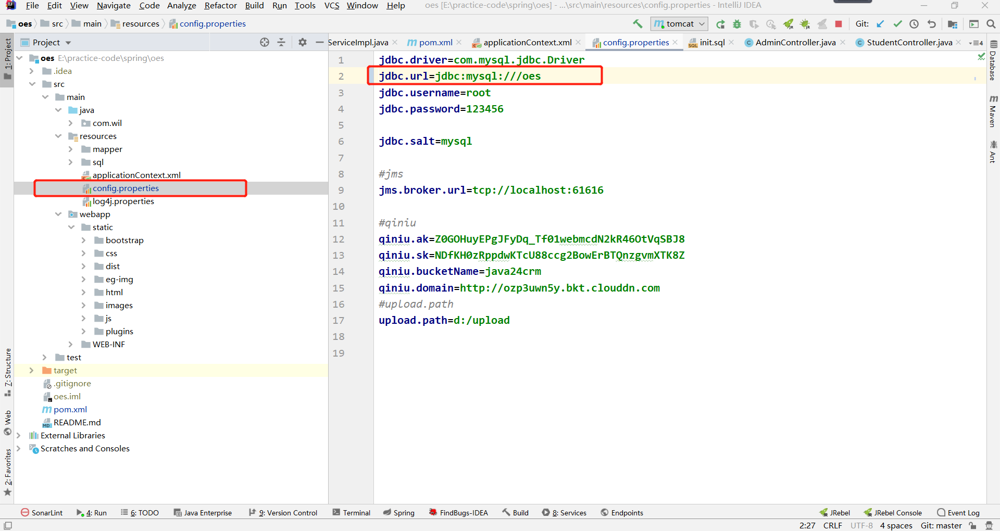
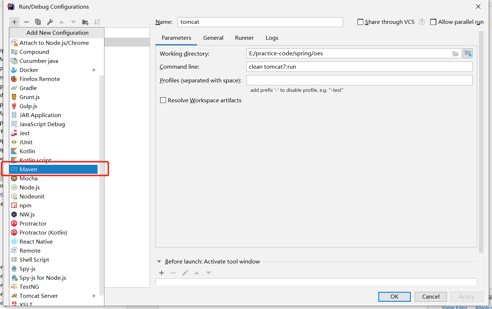
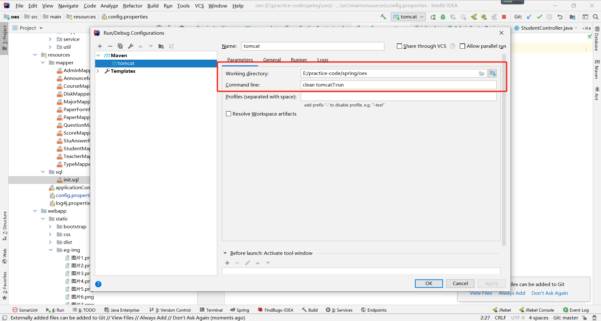
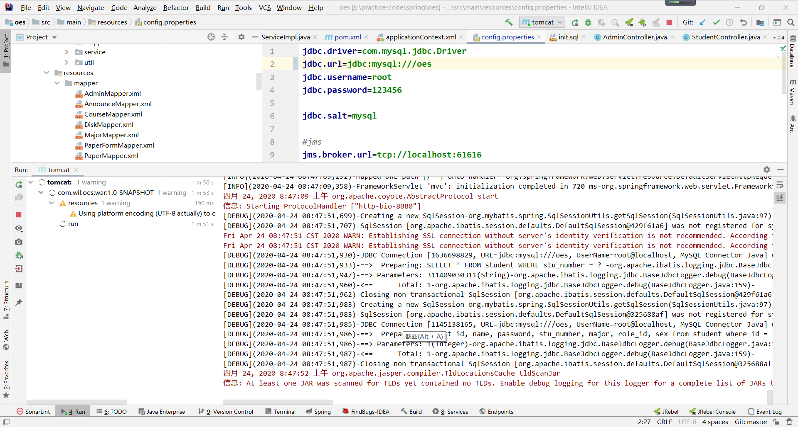

   
   
   
   
   
 
  
 
# OES 一款PC端的在线考试系统
## 概述
  这个项目是我的本科毕设作品，完全的个人项目，在工作几个月后，突然觉得应该好好写一写readme。该考试系统的用户类型有三种：教师、学生、管理员。
  系统实现了一张试卷从产生到被做再到被评分的一系列过程。代码中注释十分详细，适合同样在做该课题的毕业生参考。
## 技术栈
  * 前端：AdminLTE bootstrap jQuery ajax jsp  
  * 后端：java8 ssm框架 mvc模式 maven  
  * 数据库：mysql 
## 系统主要实现功能
  ### 教师端
  * 个人设置：更换密码。
  * 课程管理：教师添加自己的任课课程信息，默认一个课程只能有一个老师。
  * 试题管理：教师可以通过添加试题丰富题库，也可以对已存在的题目进行修改和删除操作。
  * 试卷管理：教师首先创建或选择试卷模版，系统会根据模版自动从题库中抽取题目进行组卷。
  * 考试管理：试卷产生后会自动出现在学生考试系统中，若需要取消考试，可以在此处设置。
  * 试卷复查：考生的主观题答案会被保存到数据库中，教师可以对其进行复查。
  * 成绩统计分析：本系统可以根据特定课程或特定班级使用柱状图，折线图，数据罗列等方式帮助教师更直观得了解学生成绩情况。
  * 系统网盘：教师可以上传资料到网盘供学生下载学习
  ## 学生端
  * 个人信息管理：登录密码修改。
  * 我的考试：学生进入后会看到试卷信息，当有需要参加的考试时，点击进入即可来到考试界面。
  考试结束系统会自动提交考卷并完成自动改卷任务。
  * 我的成绩：展示每门考试的成绩列表。
  * 成绩分析：系统会统计出该生本学期参加每门考试的成绩，以及该门课程的平均成绩，使用雷达图进行对比。
  * 系统网盘：学生只能下载网盘中的资料,不能上传
  ## 管理端
  * 基本数据管理：对系统内置数据的录入。
  * 系统维护：查看系统日志，接收用户问题反馈。
  * 系统公告管理：在必要时发布系统公告，如系统版本更新等
  ## 启动说明
  一、 操作环境
  1. JDK:1.8
  2. Mysql:5.6及以上
  3. 编辑器:idea任意版本
  
  二、 初始化数据库
  1. 创建数据库
  2. 执行/resources/sql/init.sql
  
  三、 idea启动配置
  1. 修改配置文件/resources/config.properties中数据库名、用户名称、密码。
  2. 点击idea右上角锤子旁边的下拉选择，选择Edit Configuration。
  3. 配置一个maven启动，command line设置命令： clean tomcat7:run。
  4. 点击旁边的绿色三小按钮运行即可。
  
  ##### 启动图示
  
  
  
  
  
  
  
  
  
  ## 部分功能展示
  
  
  
  
  
  
  
  
  
  
  
  
  
  
  
  
  
  
  
  ***
  
  
  
  
  
  
  
  
  
  
  ## 后记
  可能当时毕设写完这个项目我还觉得自己挺厉害的，然后工作快两年的时候再看就发现很多技术都已经过时了，比如说ssm框架，
  现在大部分都是springboot，jsp技术我已经都不会了，现在更喜欢vue，前后端分离。然后数据库的设计现在看来也是有点问题的。
  但是如果你也是在做毕设，那么你还是可以参考一下，按照步骤启动肯定是可以的，但你如果是eclipse，或者你有一些其他的骚操作，
  那么你要百度一下了，七牛云的文件服务你应该是用不了的，我改了秘钥。
  
  
  